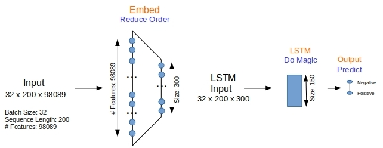
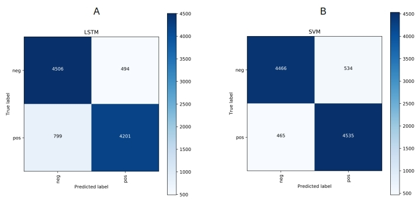

# Sentiment Analysis with Word Bags and Sequences
  
This is the source code to go along with the blog article

[Sentiment Analysis with Word Bags and Word Sequences](http://xplordat.com/2019/01/28//)

The blog evaluates the sequence respecting Long Short Term Memory (LSTM) neural nets approach to classifying movie reviews against the traditional Support Vector Machines (SVM) approach using tf-idf vectors

## Dependencies

	numpy
	scikit-learn
	keras
	tensorflow
	matplotlib

## Usage

Unpack the movie reviews data set

	tar zxvf data.tar.gz

###	LSTM

A simple LSTM model is implemented via Keras/Tensorflow

Run it with:
		
	#!/bin/bash
	PYTHONHASHSEED=0 ; pipenv run python lstm_movies.py

to obtain the results file

	lstm.json

###	Support Vector Machines

SVM is implemented via SciKit

	#!/bin/bash
	PYTHONHASHSEED=0 ; pipenv run python svm_movies.py

to obtain the results file

	svm.json

###	Plot the confusion matrices

	pipenv run python plotConfusionMatrix.py

A comparison of confusion matrices obtained with LSTM and SVM:
	

The results obtained should be as in the files lstm.json and svm.json loaded here.
